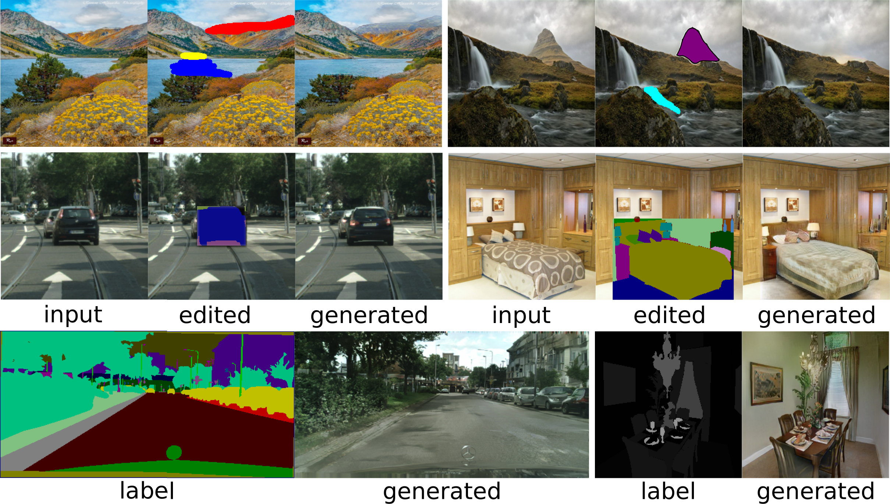

## SESAME: Semantic Editing of Scenes by Adding, Manipulating or Erasing Objects

[Paper](https://arxiv.org/abs/2004.04977) [Video](https://twitter.com/i/status/1249680641597362176)

### Datasets
Please use the preprocessing steps of [Hierarchical Image Manipulation](https://github.com/xcyan/neurips18_hierchical_image_manipulation) to prepare the datasets.

Then, use a symbolic link (ln -s) or put them in the datasets folder. 

### Pretrained Models

You can find the pretrained models for the tasks of Image Editing and Layout to Image Generation [here](https://owncloud.csem.ch/owncloud/index.php/s/YD0JyynKNEbgde5)! 

### Training/Testing Scripts
Use the files in the scripts folder to train/test the model.

<pre><code>
@inproceedings{10.1007/978-3-030-58542-6_24,
abstract = {Recent advances in image generation gave rise to powerful tools for semantic image editing. However, existing approaches can either operate on a single image or require an abundance of additional information. They are not capable of handling the complete set of editing operations, that is addition, manipulation or removal of semantic concepts. To address these limitations, we propose SESAME, a novel generator-discriminator pair for Semantic Editing of Scenes by Adding, Manipulating or Erasing objects. In our setup, the user provides the semantic labels of the areas to be edited and the generator synthesizes the corresponding pixels. In contrast to previous methods that employ a discriminator that trivially concatenates semantics and image as an input, the SESAME discriminator is composed of two input streams that independently process the image and its semantics, using the latter to manipulate the results of the former. We evaluate our model on a diverse set of datasets and report state-of-the-art performance on two tasks: (a) image manipulation and (b) image generation conditioned on semantic labels.},
address = {Cham},
author = {Ntavelis, Evangelos and Romero, Andr{\'{e}}s and Kastanis, Iason and {Van Gool}, Luc and Timofte, Radu},
booktitle = {Computer Vision -- ECCV 2020},
editor = {Vedaldi, Andrea and Bischof, Horst and Brox, Thomas and Frahm, Jan-Michael},
isbn = {978-3-030-58542-6},
pages = {394--411},
publisher = {Springer International Publishing},
title = {{SESAME: Semantic Editing of Scenes by Adding, Manipulating or Erasing Objects}},
year = {2020}
}

</code></pre>

We would like to thank the following repos, their code was essential in the developement of this project:

- https://github.com/NVlabs/SPADE
- https://github.com/xcyan/neurips18_hierchical_image_manipulation  
